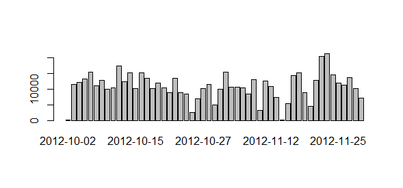

Reproducible Research: Peer Assessment 1
========================================================

This is a submission for the *Reproducible Research* course, which is part of the data science specialization.

## Loading and preprocessing the data
In order for this code to work, the ZIP file containing the activity data must be inside the working directory. It is assumed that the the ZIP archive is already extracted. The ZIP can be downloaded from [here] https://d396qusza40orc.cloudfront.net/repdata%2Fdata%2Factivity.zip

Set the correct working for R to locate the extracted data file.

```r
setwd("C:/Users/nma/Documents/R/repr_rsrch_proj1")
```
Upon extracting the archive, the CSV is read using read.csv. The data is stored into a dataframe. The date attribute is converted into data using `as.Date`.

```r
read_activityData<- read.csv("activity.csv")
read_activityData$date <- as.Date(read_activityData$date) # convert strings to date
head(read_activityData)
```

```
##   steps       date interval
## 1    NA 2012-10-01        0
## 2    NA 2012-10-01        5
## 3    NA 2012-10-01       10
## 4    NA 2012-10-01       15
## 5    NA 2012-10-01       20
## 6    NA 2012-10-01       25
```

By converting the date strings to Date objects, it becomes easier to extract week days vs. weekends and do the time based plots.

## What is the mean total number of steps taken per day?

Some pre-processing is done to omit rows with NA values.

```r
activityDataCleaned <- read_activityData[complete.cases(activityData),]
print(nrow(read_activityData))
```

```
## [1] 17568
```
We see that a few thousand rows are removed in this manner.

```r
print(nrow(activityDataCleaned))
```

```
## [1] 15264
```
## What is mean total number of steps taken per day?
Using `barplot` the total number of steps per day are determined

```r
steps_per_day <- aggregate(steps ~ date, data = activityDataCleaned, FUN = sum)
barplot(steps_per_day$steps, names.arg = steps_per_day$date)
```

 

Calculate the mean and median steps per day from this cleaned data set:

```r
aggregatedPerDate <- aggregate(activityDataCleaned$steps, by=list(activityDataCleaned$date), FUN=sum)
print(mean(aggregatedPerDate$x))
```

```
## [1] 10766
```

```r
print(median(aggregatedPerDate$x))
```

```
## [1] 10765
```

## What is the average daily activity pattern?

Using the cleaned data set with missing values removed, the below plot gives the activity per time interval averaged over all the days:


```r
meansPerInterval <- aggregate(activityDataCleaned$steps,by=list(activityDataCleaned$interval), FUN=mean)
mediansPerInterval <- aggregate(activityDataCleaned$steps,by=list(activityDataCleaned$interval), FUN=median)
# Find maximum
ggplot(data=meansPerInterval, aes(x=Group.1, y=x)) + 
    geom_line() + geom_point() + xlab("Interval") +
    ylab("Average number of steps")
```

 

Time interval with maximum average number of steps:

```r
maximumIndex <- which.max(meansPerInterval$x)
print(meansPerInterval[maximumIndex,"Group.1"])
```

```
## [1] 835
```

## Imputing missing values

It is observed that the input dataset consists of NA. This is obtained using `is.na`, to determine the length of the vector for which 'steps' is NA:

```r
print(length(which(is.na(activityData$steps))))
```

```
## [1] 2304
```


The missing values are imputed by interpolating the NA values by taking the mean number of steps from the 'complete' dataset obtained earlier. Then the original data set is copied, loop through it to find NA data, and use the 'mean steps per interval' table as a lookup table to fill in these values.


```r
# Copy old data frame
copy <- as.data.frame(activityData)
## Replace NA data with means from 'means per interval' frame
for (i in 1:nrow(copy)) {
    if (is.na(copy[i,"steps"])) {
        intervalToSearch <- copy[i,"interval"]
        value <- meansPerInterval[meansPerInterval$Group.1 == intervalToSearch, "x"]
        copy[[i,"steps"]] <- value
    }        
}
print(head(copy))
```

```
##     steps       date interval
## 1 1.71698 2012-10-01        0
## 2 0.33962 2012-10-01        5
## 3 0.13208 2012-10-01       10
## 4 0.15094 2012-10-01       15
## 5 0.07547 2012-10-01       20
## 6 2.09434 2012-10-01       25
```

We confirm that there are no more NA:

```r
sum(is.na(copy$steps))
```
```
[1] 0
```

Now we make a histogram similar to the one above, but using our interpolated data set.

```r
ggplot(copy, aes(x=as.factor(date), y=steps)) + geom_bar(stat="identity")  +
    theme(axis.text.x=element_text(angle=-90)) + xlab("Date")
```

 


```r
aggregatedPerDateInterpolated <- aggregate(copy$steps, by=list(copy$date), FUN=sum)
print(mean(aggregatedPerDateInterpolated$x))
```

```
## [1] 10766
```

```r
print(median(aggregatedPerDateInterpolated$x))
```

```
## [1] 10766
```

Based in the differences between the values above, the impact from interpolating the missing data seems to be quite minimal 

## Are there differences in activity patterns between weekdays and weekends?

By splitting the filled-out data set into two, for week days and weekends, we can create an extra 'type' column indicating whether the data was collected on a weekday or a weekend day, and paste the data together again.


```r
# Add column with day of weekยง
copy$Weekday <- weekdays(copy$date)
# Split into week days vs weekends
weekdays <- copy[copy$Weekday != "Saturday" & copy$Weekday != "Sunday",]
weekends <- copy[copy$Weekday == "Saturday" | copy$Weekday == "Sunday",]
#Create means per interval
weekdayIntervalMeans <-aggregate(weekdays$steps,by=list(weekdays$interval), FUN=mean)
weekendIntervalMeans <-aggregate(weekends$steps,by=list(weekends$interval), FUN=mean)
weekdayIntervalMeans$type <- "Weekday"
weekendIntervalMeans$type <- "Weekend"
# Paste together again
pastedData <- rbind(weekdayIntervalMeans,weekendIntervalMeans)
```

We can then use this 'type' column as *facets* in a ggplot plot.


```r
ggplot(data=pastedData, aes(x=Group.1, y=x)) + 
    geom_line() + xlab("Interval") +
    ylab("Average number of steps") + facet_grid(type ~ .)
```
